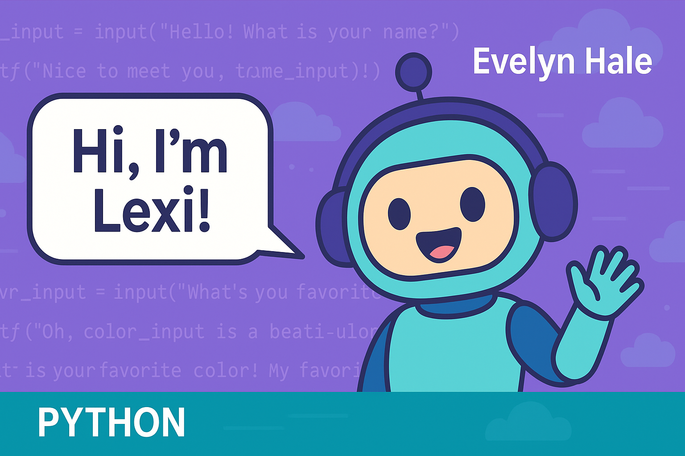

<p align="center">
  
</p>

# Lexi the Chatbot

Lexi is my very first Python chatbot project, created as part of my journey into learning programming and cloud technology!

This simple command-line chatbot introduces itself, asks for your name, age, favorite color, and favorite hobby — then responds with fun, personalized messages.

## Features

- Greets the user
- Asks for:
  - Name
  - Age
  - Favorite color
  - Favorite hobby
- Responds with dynamic and friendly messages
- Calculates the age difference between the user and Lexi

## Example Interaction

Hello! What is your name?

Evelyn
Nice to meet you, Evelyn! My name is Lexi!

How old are you?

30
You are 27 years older than me. I'm just 3!

What's your favorite color?

Purple
Oh, Purple is a beautiful color! My favorite color is Sky Blue.

What is your favorite hobby?

Reading
Nice! Reading sounds like a lot of fun! My favorite hobby is learning about people.


## How to Run It

Make sure you have Python installed, then:

```bash
python script.py
